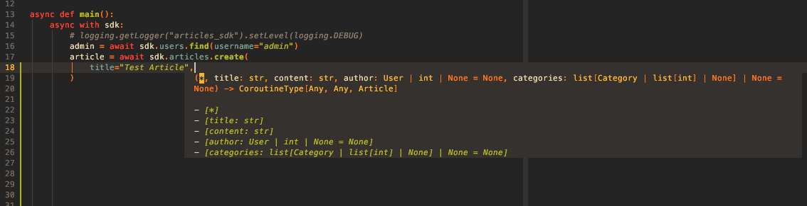

# SDK

djsonapi generates **sealed, typed SDKs** from your API definition. The output
is plain code that mirrors your exact resource types, operations, query
parameters — with full IDE autocomplete.

## How it works

The server's `DjsonApi` registry holds every endpoint, resource class, and
query parameter. The SDK generator reads this registry and writes plain source
files. You copy the output directory into your project and install the
dependencies manually (only `aiohttp` for Python, zero for TypeScript).

The generated package contains:

- A concrete class per resource type with the exact fields, relationships, and
  capabilities your server exposes
- Typed method signatures for `get`, `create`, `save`, `delete`, `find`,
  relationship mutations — only those actually registered
- A `Collection` class with typed filter/sort/page methods matching your
  declared query parameters
- Error classes for every HTTP status your server can return

## Runtime

Both Python and TypeScript SDKs include a runtime layer (`_runtime/`) that
handles the JSON:API protocol — parsing responses, serializing requests,
resolving included resources, managing relationship stubs.

The runtime is **copied verbatim** into the generated package. The SDK has zero
dependency on `djsonapi` itself.

## Python vs TypeScript

=== "Python"
    - Dependency: `aiohttp` (for async HTTP)
    - Async-only (`async with sdk:`, `await resource.save()`)
    - Dataclass-based Resource classes
    - `Collection` is `Sequence[T]` with lazy chaining

=== "TypeScript"
    - Zero npm dependencies (uses `fetch`, `URL`, `URLSearchParams`)
    - Async with native `fetch`
    - Class-based Resource with getters/setters
    - `Collection` is `AsyncIterable<T>` with lazy chaining

## IDE support

Generated SDKs are fully typed — every method, every parameter, every return
value:

=== "Python"
    ```python
    # Your IDE knows sdk.articles is a type with .get(), .create(), .list()
    # It knows article.title is str, article.created_at is datetime
    # It knows article.save() accepts only writable fields
    ```
=== "TypeScript"
    ```typescript
    // Your IDE knows sdk.articles has .get(), .create(), .list()
    // It knows article.title is string, article.created_at is Date
    // 'article.save({|}' suggests only title, content, author
    ```


